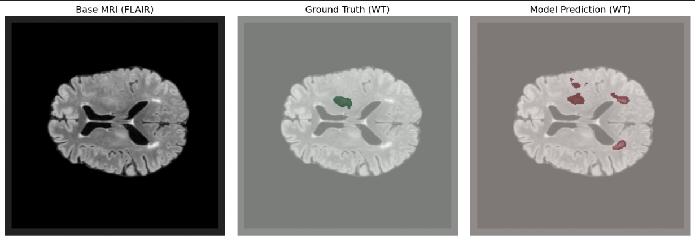
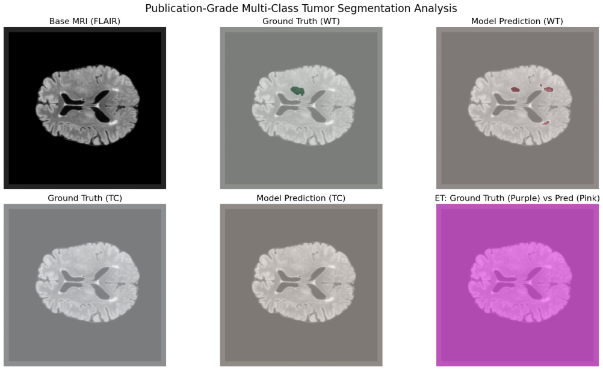
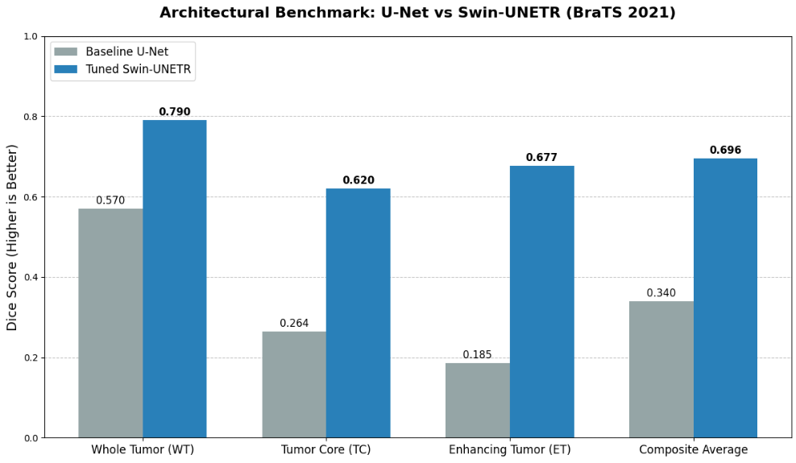

# 🧠 Multi-Modal Brain Tumor Segmentation using Swin-UNETR and U-Net on BraTS 2021


---

# 📌 Project Overview

Brain tumor segmentation plays an important role in modern medical imaging by assisting clinicians in identifying tumor boundaries for diagnosis, treatment planning, and disease monitoring. Manual segmentation of MRI scans is accurate but time-intensive and requires specialized expertise, motivating the use of deep learning to automate the process.

This project presents a complete end-to-end deep learning pipeline for multi-modal brain tumor segmentation using the **BraTS 2021** dataset. The implementation was developed entirely inside a Kaggle Notebook and covers every stage of the workflow—from automatic dataset extraction and preprocessing to model training, evaluation, visualization, and checkpoint generation.

To understand the impact of different neural network architectures, two segmentation models were implemented and evaluated under the same experimental setup:

- **MONAI Swin-UNETR** (Transformer-based)
- **MONAI U-Net** (Convolutional baseline)

The objective was not only to build a working segmentation pipeline but also to investigate how transformer-based architectures compare with conventional convolutional networks for segmenting clinically relevant brain tumor sub-regions.

---

# 🎯 Motivation

Magnetic Resonance Imaging (MRI) provides detailed structural information about brain tumors, but accurately identifying tumor boundaries remains a challenging task due to:

- Large variations in tumor size and appearance
- Irregular and diffuse tumor boundaries
- Significant intensity variations across MRI modalities
- Class imbalance between healthy tissue and tumor regions

Recent transformer-based architectures have shown strong performance in medical image analysis because they can model long-range spatial relationships more effectively than conventional convolutional networks.

This project explores whether Swin-UNETR can improve segmentation quality over a standard U-Net baseline while maintaining a reproducible and efficient workflow within the computational constraints of a Kaggle GPU environment.

---

# 🧬 Dataset

This work uses the **BraTS 2021 Task 1** dataset containing multi-modal MRI scans from **1,251 patients**.

Each patient record consists of four co-registered MRI modalities:

- T1-weighted (T1)
- T1 Contrast-Enhanced (T1CE)
- T2-weighted (T2)
- Fluid Attenuated Inversion Recovery (FLAIR)

The original dataset is provided as compressed NIfTI (`.nii.gz`) volumes within a `.tar` archive of approximately **12.4 GB**.

Ground-truth segmentation labels are converted into three clinically meaningful targets:

| Target | Description |
|---------|-------------|
| WT | Whole Tumor |
| TC | Tumor Core |
| ET | Enhancing Tumor |

---

# ⚙️ Pipeline Overview

The complete workflow follows the sequence below:

```
BraTS Archive
        │
        ▼
Automatic Extraction
        │
        ▼
Dataset Verification
        │
        ▼
Custom PyTorch Dataset
        │
        ▼
MRI Slice Extraction
        │
        ▼
Normalization
        │
        ▼
Spatial Padding
        │
        ▼
DataLoader Construction
        │
        ▼
Model Initialization
        │
        ▼
Training
        │
        ▼
Fine-Tuning
        │
        ▼
Evaluation
        │
        ▼
Visualization
        │
        ▼
Model Checkpoint Saving
```

The entire pipeline executes sequentially inside a single Kaggle notebook, making it straightforward to reproduce the experiments.

---

# 🧹 Data Preprocessing

A custom `BraTS2DSurvivalDataset` was implemented to process the raw MRI volumes during training.

The preprocessing pipeline includes:

- Automatic dataset detection
- Archive extraction when necessary
- Loading NIfTI MRI volumes
- Center axial slice extraction
- Four-channel input construction
- Independent Z-score normalization
- Symmetric zero-padding
- Multi-channel target encoding

The four MRI modalities are stacked to create an input tensor of shape:

```
(4, 240, 240)
```

Each modality is normalized independently using Z-score normalization before training.

To satisfy the architectural requirements of Swin-UNETR, each image is padded from

```
240 × 240
```

to

```
256 × 256
```

Ground-truth masks are transformed into three binary segmentation channels representing Whole Tumor (WT), Tumor Core (TC), and Enhancing Tumor (ET).

The final target tensor has shape:

```
(3, 256, 256)
```

---

# 🏗️ Model Architectures

Two different segmentation models were evaluated.

## Swin-UNETR

The primary model is based on the MONAI implementation of Swin-UNETR.

Configuration:

- Transformer encoder
- CNN decoder
- Four input channels
- Three output channels
- **6,303,261 trainable parameters**

---

## U-Net

A standard MONAI U-Net was trained under identical conditions to serve as a baseline.

Configuration:

- Encoder-decoder CNN
- Residual units
- Four input channels
- Three output channels
- **1,626,360 trainable parameters**

---

# 🚀 Training Strategy

Training was performed in two stages.

### Stage 1 — Initial Training

- Optimizer: AdamW
- Learning Rate: 1e-4
- Weight Decay: 1e-5
- Epochs: 5
- Loss Function: Dice Loss

---

### Stage 2 — Fine-Tuning

The best checkpoint from Stage 1 was reloaded and optimized further using:

- AdamW
- CosineAnnealingLR
- Learning Rate:
  5e-5 → 1e-6
- Weight Decay:
  1e-4
- Epochs:
  3

This second stage focused on improving segmentation boundaries while reducing scattered false-positive predictions.

---

# 📊 Evaluation Strategy

Performance was evaluated using a custom implementation of **BraTSMetrics**.

The following metrics were computed independently for each tumor region:

- Dice Similarity Coefficient (DSC)
- Intersection over Union (IoU)
- Precision
- Sensitivity
- Specificity

Evaluation was performed on an unseen validation set consisting of **251 patients**.

---

# 📈 Results

The Swin-UNETR model consistently outperformed the baseline U-Net across all tumor regions.

| Model | WT | TC | ET | Composite Dice |
|------|------:|------:|------:|------:|
| U-Net | 0.5699 | 0.2639 | 0.1854 | 0.3397 |
| **Swin-UNETR** | **0.7905** | **0.6197** | **0.6767** | **0.6956** |

The largest improvement was observed for the **Enhancing Tumor (ET)** class, where the transformer-based architecture produced substantially better segmentation performance than the convolutional baseline.

---

# 📷 Qualitative Analysis

In addition to quantitative evaluation, the notebook generates visualization panels comparing:

- Original MRI slice
- Ground-truth segmentation
- Predicted segmentation
- Overlay comparisons

These visualizations provide qualitative insight into model performance and help identify false-positive and false-negative predictions.





---

# 📊 Performance Comparison



The comparison chart summarizes the performance difference between the baseline U-Net and the Swin-UNETR model across all evaluated tumor regions.

---

# 💻 Technologies Used

- Python
- PyTorch
- MONAI
- NumPy
- Nibabel
- Matplotlib
- Kaggle Notebook
- NVIDIA Tesla T4 GPU

---

# 📂 Repository Structure

Current repository structure:

```
Brain-Tumor-Segmentation-SwinUNETR/

├── internship.ipynb
└── README.md
```

The implementation is intentionally maintained as a single notebook to preserve the original experimental workflow and ensure reproducibility.

---

# ▶️ Running the Project

1. Open the notebook in Kaggle.
2. Enable GPU acceleration.
3. Attach the BraTS 2021 Task 1 dataset.
4. Execute the notebook sequentially from top to bottom.
5. Model checkpoints are automatically saved to:

```
/kaggle/working/saved_models/
```

---

# ⚠️ Current Limitations

While the implementation successfully demonstrates an end-to-end segmentation workflow, several limitations remain.

- Only the center axial slice is processed instead of the full 3D MRI volume.
- Training was intentionally limited to a small number of epochs due to Kaggle runtime constraints.
- Data augmentation techniques were not incorporated into the current pipeline.
- The implementation is contained within a single notebook rather than modular Python files.

These limitations provide opportunities for future extensions without affecting the reproducibility of the current implementation.

---

# 🔮 Future Work

Potential directions for extending this project include:

- Full 3D volumetric segmentation
- Advanced data augmentation strategies
- Longer training schedules
- Mixed precision training
- Multi-GPU training
- Automated hyperparameter optimization
- Deployment as an inference application
- Refactoring into a modular Python package

---

# 🙏 Acknowledgements

This project builds upon the contributions of the open-source research community.

Special thanks to:

- BraTS 2021 Challenge
- MONAI
- PyTorch
- Kaggle

for providing the datasets, frameworks, and computational resources that made this work possible.
